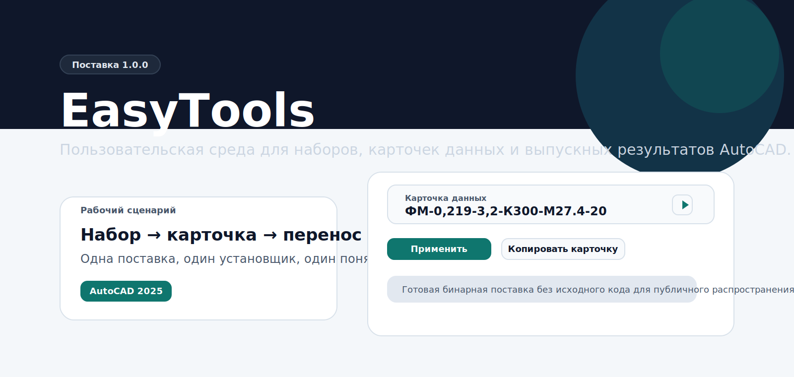

  

# EasyTools

EasyTools — рабочая среда для наборов данных, карточек объектов и выпускных данных в AutoCAD. Проект собирает в одном пользовательском интерфейсе регистрацию объектов, работу с набором параметров, перенос карточек данных, массовое редактирование и подготовку табличных результатов.

Публичный репозиторий содержит только пользовательскую поставку. Разработка и исходный код ведутся отдельно. Здесь размещаются бинарные файлы, установщик и документы по выпуску версии.

## Что входит в поставку

- Установщик EasyTools для AutoCAD 2025.
- Скомпилированный `EasyTools.bundle` без исходного кода.
- Контрольная сумма SHA-256.
- Статическая страница проекта для загрузки и краткой навигации.

## Релиз 1.0.0

- Каталог релиза: [`release/1.0.0`](./release/1.0.0)
- Установщик: [`EasyTools.Setup.exe`](./release/1.0.0/EasyTools.Setup.exe)
- Контрольная сумма: [`EasyTools.Setup.exe.sha256`](./release/1.0.0/EasyTools.Setup.exe.sha256)
- Примечания к версии: [`RELEASE.md`](./release/1.0.0/RELEASE.md)

## Для чего нужен EasyTools

- Вести объекты AutoCAD через единый набор прикладных карточек данных.
- Запоминать и переносить карточки данных между объектами без ручной перепаковки payload.
- Работать с одиночным и множественным выбором объектов в одном процессе.
- Готовить сводные табличные результаты по рабочему набору.
- Снизить объём ручных действий при выпуске повторяющихся инженерных данных.

## Установка

1. Откройте каталог [`release/1.0.0`](./release/1.0.0).
2. Скачайте `EasyTools.Setup.exe`.
3. При необходимости проверьте SHA-256 по файлу `EasyTools.Setup.exe.sha256`.
4. Запустите установщик.
5. Нажмите кнопку установки в окне EasyTools Setup.
6. Пакет будет развернут в `%APPDATA%\Autodesk\ApplicationPlugins\EasyTools.bundle`.

## Состав публичного репозитория

- В репозиторий не входят исходные тексты, solution-файлы и девелоперская инфраструктура.
- Репозиторий ориентирован только на пользовательское распространение готовой версии.
- Все пути и материалы в этом репозитории относятся к поставке `1.0.0`.

## Страница проекта

- GitHub Pages: `https://asppel.github.io/easytools/`
- Репозиторий: `https://github.com/asppel/easytools`

## Идея продукта

Идеальный EasyTools — это прикладная инженерная надстройка, в которой пользователь работает не с разрозненными командами и служебными окнами, а с цельным процессом: выбрал набор, зафиксировал карточку, перенёс параметры на нужные объекты, выполнил регистрацию, получил итоговые данные. Поставляемая версия ориентирована именно на такой сценарий: минимальный вход, понятная установка и готовая рабочая сборка без промежуточных шагов.
